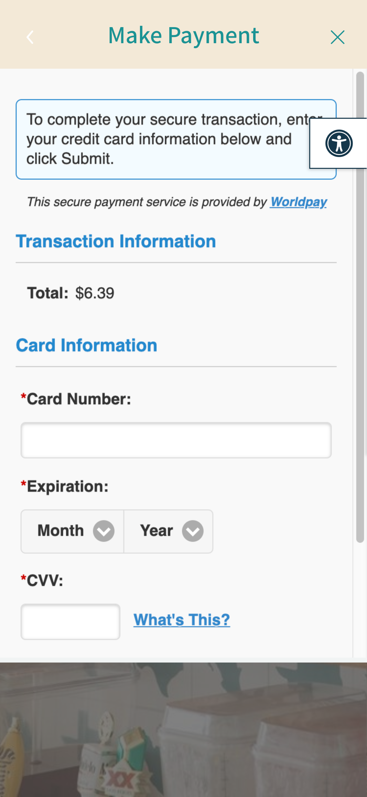

# auto-fill-test
Testing the ability to autofill a Credit Card form in reacet-native webview

### (1) Create a dummy react-native app using Expo 

the app will feature 

- a webview that loads this 
https://us-tabitorder.tabit.cloud/?site=5d31f21f385cc47523a671c9#/start

- an integration with https://github.com/tipsi/tipsi-stripe

### (2) Testing AutoFill of Credit Card form 

When we get to this screen in the webview flow. (you get there by adding some items to the cart and atempting to pay) 

We want to autofill the **Credit Card Number** **Expiration** and **CVV** by grabing the Credit Card info stored on a dummy user in Stripe using test mode. 

